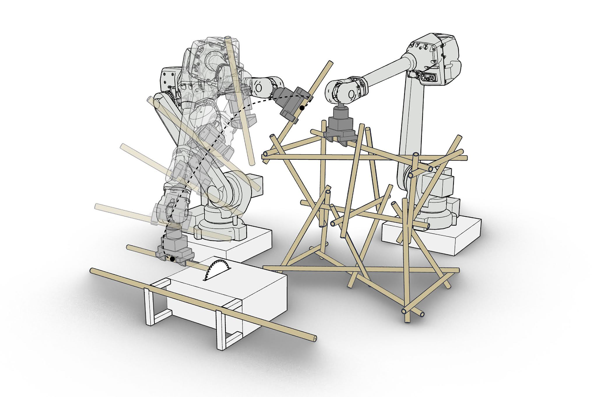

# Workshop: Robotic Fabrication in Rhino with the COMPAS framework

## McNeel Europe

> 13-15 December 2021

👉 [Slides](https://docs.google.com/presentation/d/1XioagUYqCVWCgxudyw0m4pQa-cu9_5Pf7duuSE7PYMo) | [Overview](#overview) | [Examples](examples/) | [Requirements](#requirements) | [Installation](#installation)

## Overview

### Day 1

* Introduction to digital fabrication.
* Overview of COMPAS framework.
* Fundamental concepts of robotics: components of an industrial robot, robot workspace, control modes, robot positioning (cartesian and joint space) and singularities, robot coordinate frames and transformations.
* Description of robot models, the URDF format, visualizing robot models, interop with external model sources. Grasshopper integration. Exercise: build your own robot model.
* Forward Kinematics (in-process and out-process) and Inverse Kinematics (overview of analytic and numerical solvers).

### Day 2

* Overview of supported robotic backends.
* ROS: Robot Operating System and the MoveIt! Motion planning framework. ROS communication model: topics, services and actions.
* Path planning: Cartesian and kinematic path planning from Rhino and Grasshopper using MoveIt backend. Defining goal constraints.
* Planning scene manipulation. Dynamic end-effector attachment and detachment.
* Describing assembly processes in code. Basic structure of a pick and place process. Approach frames. Overview of advanced assembly structures: graphs/partial orders/networks.
* Fabrication-aware design: the impact of sequencing in spatial assembly processes.
* Exercise: path planning of a simple assembly structure.

### Day 3

* ABB robot control with RRC.
* Comparison of robot control modes: offline, online real-time, online non-real-time control.
* RRC control primitives: blocking, non-blocking, and deferred blocking.
* Overview of RRC instruction set: motion, IO control, custom instructions.
* Remote control exercise with one of the robots of the Robotic Fabrication Lab at ETH Zurich.

## Requirements

* Minimum OS: Windows 10 Pro or Mac OS Sierra 10.12
* [Anaconda 3](https://www.anaconda.com/distribution/)
* [Docker Desktop](https://www.docker.com/products/docker-desktop) After installation on Windows, it is required to enable `"Virtualization"` on the BIOS of the computer.
* [Rhino 6/7 & Grasshopper](https://www.rhino3d.com/download)
* [Visual Studio Code](https://code.visualstudio.com/): Any python editor works, but we recommend VS Code and extensions, [see the documentation](https://gramaziokohler.github.io/compas_fab/latest/getting_started.html#working-in-visual-studio-code)
* [ABB RobotStudio](https://new.abb.com/products/robotics/robotstudio) (only available on Windows, trial version available):
Once installed, go to the `Add-in` tab, and install the latest version available of `RobotWare for IRC5 controllers`.

## Installation

We use `conda` to make sure we have clean, isolated environment for dependencies.

First time using <code>conda</code>?

Make sure you run this at least once:

    (base) conda config --add channels conda-forge

    (base) conda env create -f https://dfab.link/mcneel-2021.yml

### Add to Rhino

    (base)  conda activate fab21
    (fab21) python -m compas_rhino.install -v 7.0

### Get the workshop files

    (fab21) cd Documents
    (fab21) git clone https://github.com/gramaziokohler/workshop_mcneel_2021

### Verify installation

    (fab21) python -m compas

    Yay! COMPAS is installed correctly!

    COMPAS: 1.13.2
    Python: 3.8.10 | packaged by conda-forge | (default, May 11 2021, 06:25:23) [MSC v.1916 64 bit (AMD64)]
    Extensions: ['compas-fab', 'compas-cgal', 'compas-rrc']
